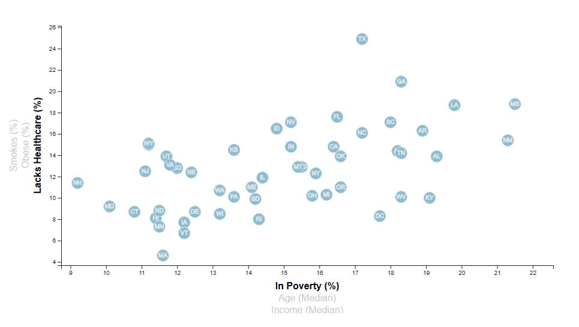
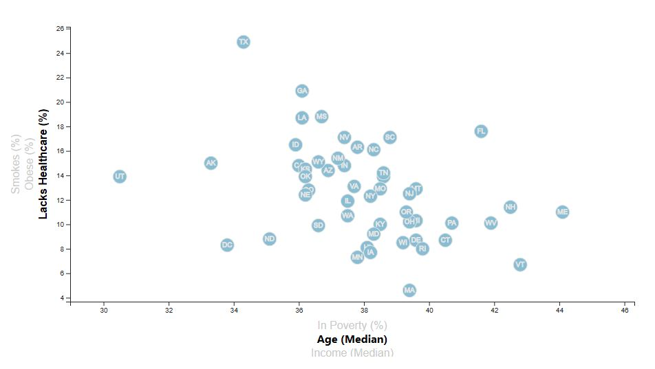
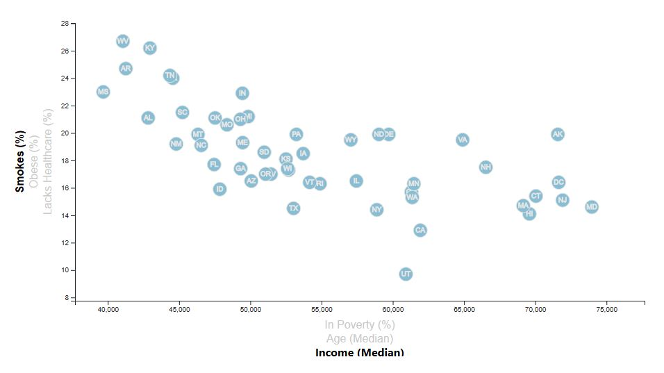

# Data Journalism

## **Objective:**
The objective of this project is to use D3 and JavaScript to create a scatterplot to present data from the US Census Bureau. Each circle on the graph represents one state. Tooltips displaying the data selected are shown when users hover over each circle. 

The interactive graph allows users to choose which data to display. Users can pick between the following:
1. X-axis - 3 demographic features:
   - Poverty
   - Age
   - Income
2. Y-axis - 3 health risk factors: 
   - Lack of healthcare
   - Obesity
   - Smoking

## **Tools:**
1. JavaScript: D3
2. HTML/CSS

## **Screenshots:**

